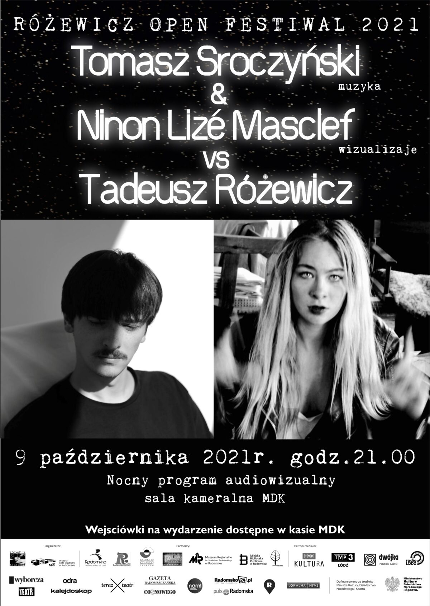
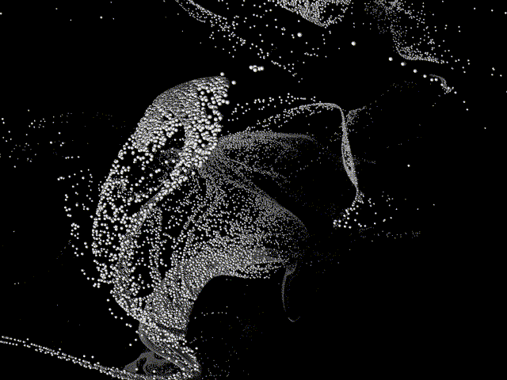

# Matka odchodzi

3D visuals of the musical performance "Matka odchodzi" for Różewicz Open Festiwal

  
 
 

- Three.js is used to render a FBO particles system, with a GPGPU approach.
- 75K Particles are animated with the violin music thanks to ml5.js.
- The poem "Matka odchodzi" from Tadeusz Różewicz is displayed.

  
  
 

 
